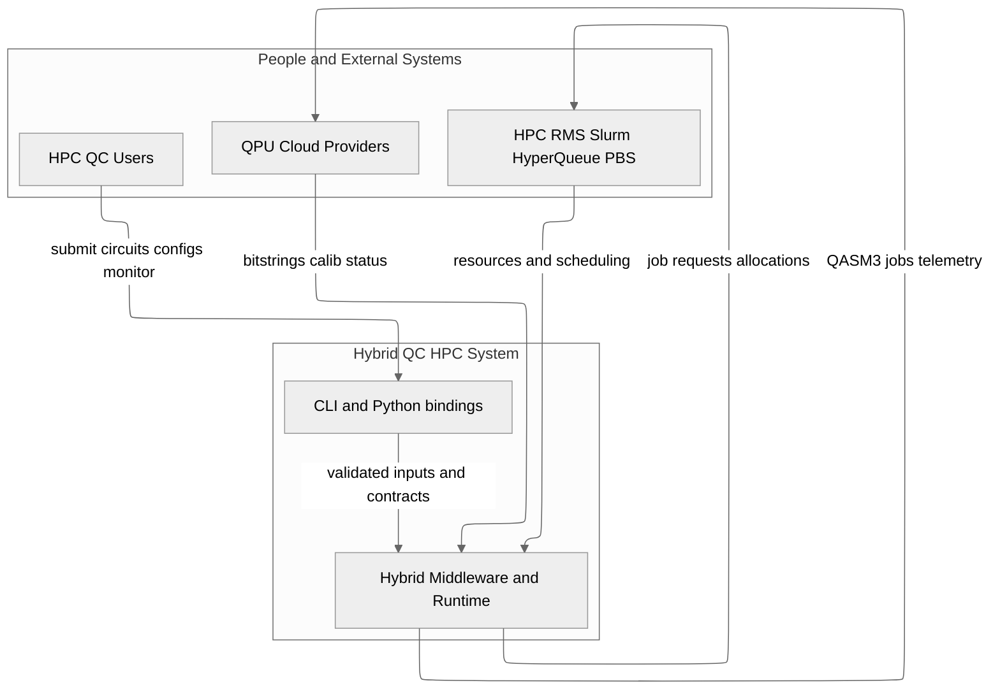

# C4 Level 1 — System Context

This document shows the context of the hybrid QC–HPC system versus users, QC cloud platforms and the BSC HPC environment.

## Relevant ADRs

[2. Product: Hybrid HPCQC middleware and runtime](../adr/0002-hybrid-hpc-qc-middleware-and-runtime-product.md)  
[4. Quantum exchange format: OpenQASM 3](../adr/0004-quantum-exchange-format-openqasm-3.md)  
[14. RMS integration: Slurm, HyperQueue, PBS](../adr/0014-rms-integration-slurm-hyperqueue-pbs.md)  
[22. QPU cloud usage limits](../adr/0022-qpu-cloud-usage-limits.md)

## Scope

- The user submits circuits and configuration to the CLI or Python bindings.
- The middleware and runtime orchestrate HPC and QPU cloud resources.
- The BSC RMS allocates CPU and GPU resources.
- QC providers execute subcircuits and return results.
