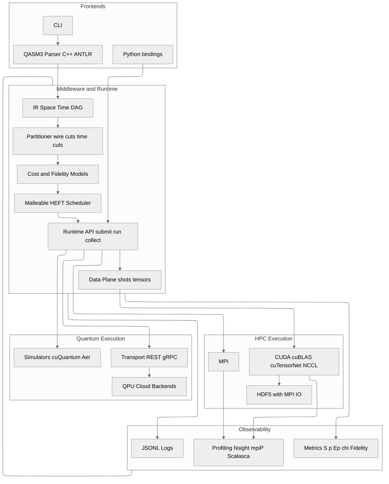

# C4 Level 2 — Container View

Decomposes the system into logical containers: frontends, middleware, runtime, backends, and observability.

## Relevant ADRs

[3. Base language and toolchain: C++17 + MPI + CUDA](../adr/0003-base-language-and-toolchain-c-23-mpi-cuda.md)  
[5. QASM3 parser with ANTLR4 in C++](../adr/0005-qasm3-parser-with-antlr4-in-c.md)  
[6. Internal IR: space–time DAG with annotations](../adr/0006-internal-ir-space-time-dag-with-annotations.md)  
[10. QPU transport and backends: REST gRPC](../adr/0010-qpu-transport-and-backends-rest-grpc.md)  
[13. Observability: logging, metrics, and profiling](../adr/0013-observability-logging-metrics-and-profiling.md)

## Interfaces

- Frontend to Core: QASM3 contracts and YAML.
- Core to HPC: MPI and CUDA kernels.
- Core to QC: REST gRPC with QASM3.
- Lateral observability with metric logs and profiling.
