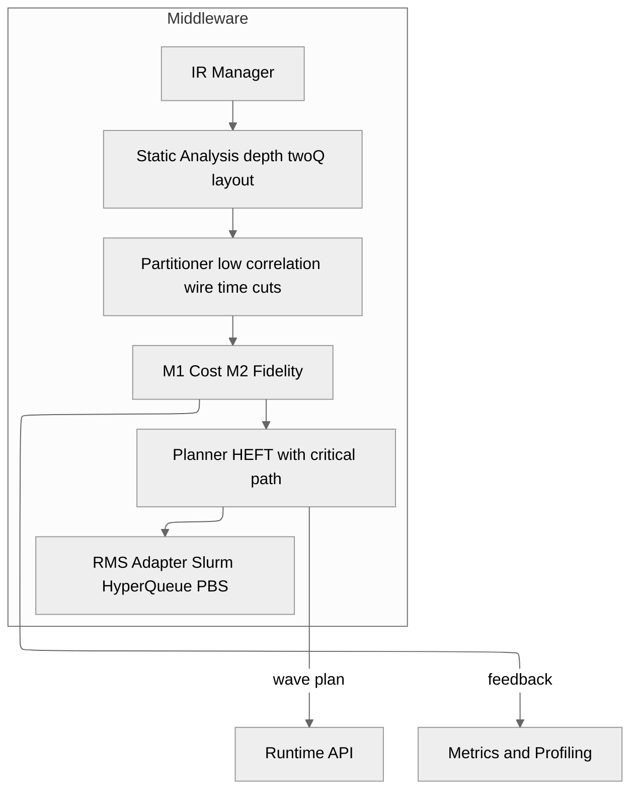

# C4 Level 3 — Component View: Middleware

Internal Middleware components: IR, Partitioner, M1 M2 Models, Scheduler, and RMS adapters.

## Relevant ADRs

[6. Internal IR: space–time DAG with annotations](../adr/0006-internal-ir-space-time-dag-with-annotations.md)  
[7. Partition policy: wire cuts and time cuts](../adr/0007-partition-policy-wire-cuts-and-time-cuts.md)  
[8. Cost and fidelity model](../adr/0008-cost-and-fidelity-model.md)  
[9. Malleable HEFT scheduler](../adr/0009-malleable-heft-scheduler.md)  
[14. RMS integration: Slurm, HyperQueue, PBS](../adr/0014-rms-integration-slurm-hyperqueue-pbs.md)

## Design Notes

- IR Manager ensures traceability and serialization for reproducibility.
- Partitioner applies cross-2Q counting heuristics and entropy estimators.
- Planner uses modified HEFT with $T_q,\,T_c,\,\text{Comm}$ and a $\Delta_F$ penalty.
