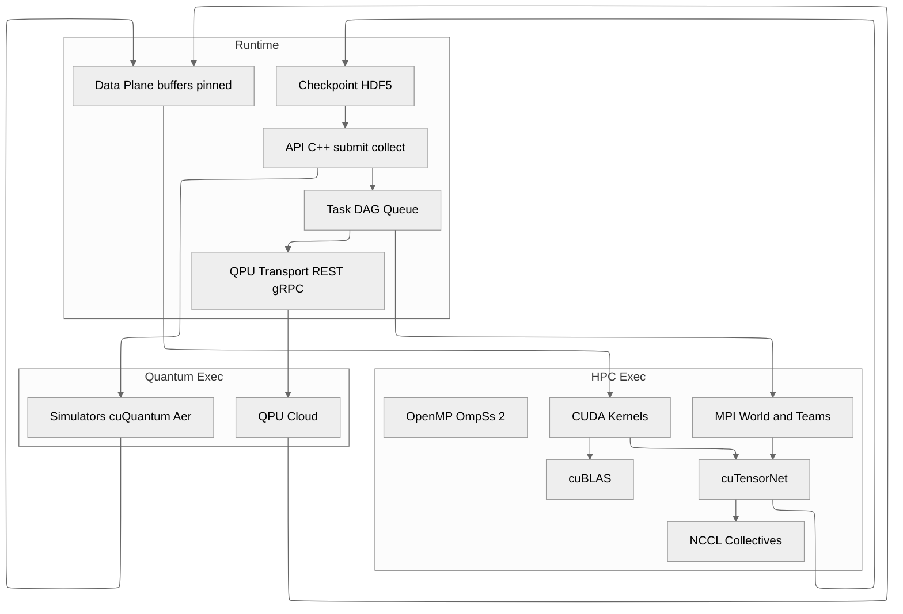

# C4 Level 3 — Component View: Runtime

Breakdown of the execution runtime and its data plane.

## Relevant ADRs

[3. Base language and toolchain: C++17 + MPI + CUDA](../adr/0003-base-language-and-toolchain-c-23-mpi-cuda.md)  
[10. QPU transport and backends: REST gRPC](../adr/0010-qpu-transport-and-backends-rest-grpc.md)  
[11. Tensor contraction stitching: cuBLAS and cuTensorNet](../adr/0011-tensor-contraction-stitching-cublas-and-cutensornet.md)  
[12. Storage and checkpointing: HDF5 with MPI-IO](../adr/0012-storage-and-checkpointing-hdf5-with-mpi-io.md)  
[17. NCCL for multi-GPU intra-node](../adr/0017-nccl-for-multi-gpu-intra-node.md)

## Responsibilities

- API exposes submit and collect.
- Task DAG Queue maintains dependencies.
- Data Plane manages shots and tensors with pinned buffers.
- cuTensorNet performs stitching and uses NCCL for collectives.
