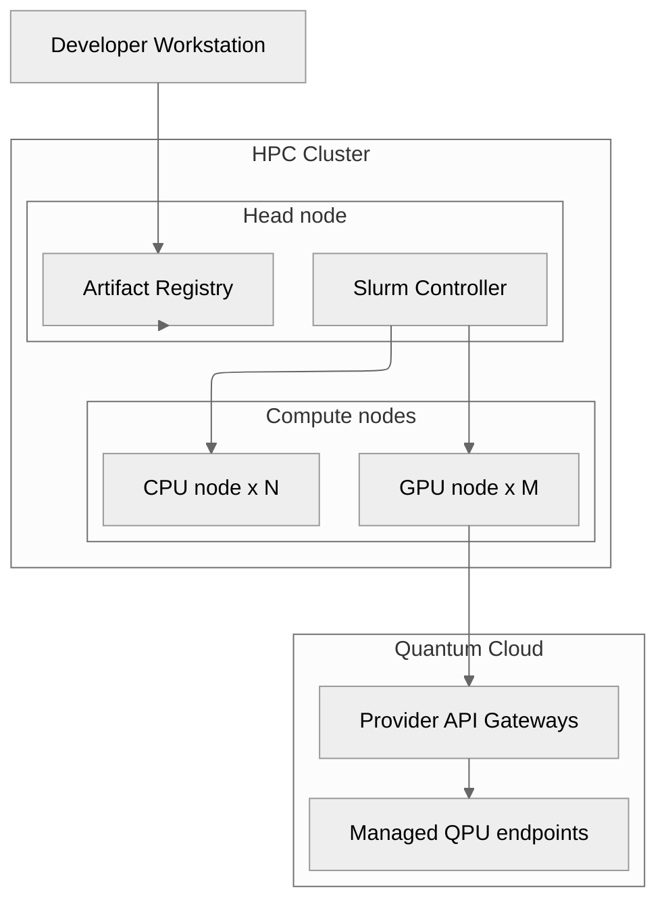

# C4 Level 2 — Deployment View

Deployment topology with CPU, GPU nodes and connection to QPU/QPU cloud.

## Relevant ADRs

[20. Containers and reproducibility with Apptainer](../adr/0020-containers-and-reproducibility-with-apptainer.md)  
[19. QPU credential security and management](../adr/0019-qpu-credential-security-and-management.md)  
[14. RMS integration: Slurm, HyperQueue, PBS](../adr/0014-rms-integration-slurm-hyperqueue-pbs.md)

## Deployment

- Binaries packaged in Apptainer.
- QPU credentials managed outside the MPI world according to ADR 0019.
- Heterogeneous CPU GPU queues and QPU windows coordinated by the middleware.
