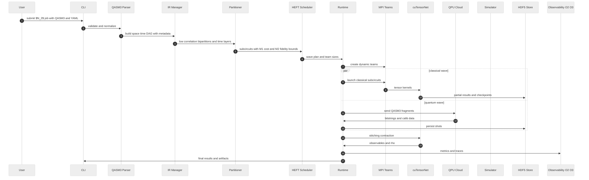

# C4 Scenario — $N_2$ Job Sequence

High-level sequence for a simulation job of the $N_2$ molecule from submission to reconstruction.

## Relevant ADRs

[6. Internal IR: space–time DAG with annotations](../adr/0006-internal-ir-space-time-dag-with-annotations.md)  
[7. Partition policy: wire cuts and time cuts](../adr/0007-partition-policy-wire-cuts-and-time-cuts.md)  
[9. Malleable HEFT scheduler](../adr/0009-malleable-heft-scheduler.md)  
[11. Tensor contraction stitching: cuBLAS and cuTensorNet](../adr/0011-tensor-contraction-stitching-cublas-and-cutensornet.md)  
[13. Observability: logging, metrics, and profiling](../adr/0013-observability-logging-metrics-and-profiling.md)

## Results

- Observables and fidelity of $N_2$.
- JSONL traces and O2 O3 profiles.
- Reproducible HDF5 checkpoints.
