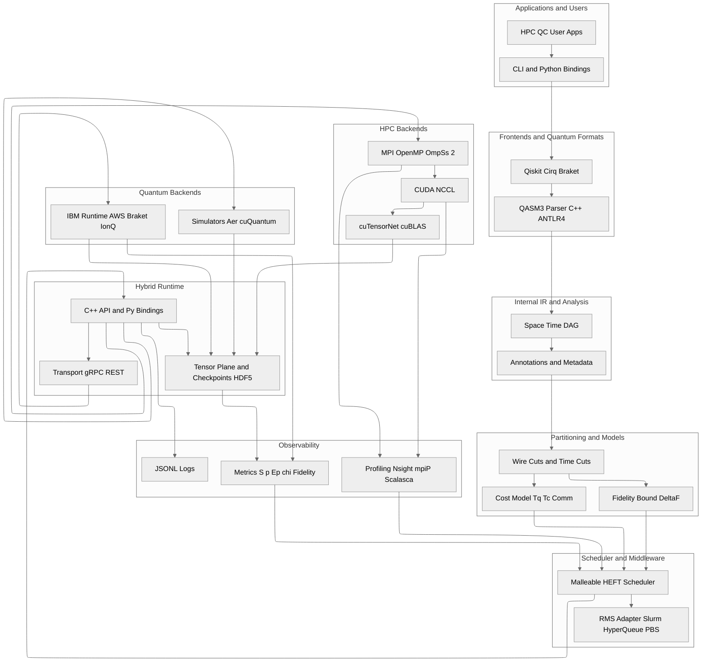

# HPCQC Hybrid Stack Documentation

This repository provides the architectural and design documentation for the Hybrid High-Performance Computing and Quantum Computing (HPCQC) Stack, currently under development as part of a research proposal. Covers the software architecture and runtime design. The documentation defines the conceptual, logical, and technical foundations of a hybrid runtime that integrates classical HPC resources with quantum backends under a unified software stack. It focuses on design rationale, interoperability between ecosystems, and formal reproducibility of hybrid workflows.

This document focuses solely on the software stack and the runtime orchestration layer, i.e., the components that enable execution, scheduling, data management, and observability in an HPCQC backend. Therefore, this documentation does not cover the theoretical framework of space-time circuit knitting, which constitutes the scientific foundation motivating this proposal. This framework considers that a quantum circuit can be decomposed into subcircuits that can be analysed and redirected to heterogeneous backends. Certain partitions are executed on HPC nodes with classical computing, while others are executed on QPU nodes or quantum clouds. In this way, we understand that bidirectional optimization is achieved.

First, temporal optimization is achieved through malleability—dynamically resizing MPI teams during QPU idle phases (a concept introduced in Rocco et al. (2025)[^1]). Specifically, classical idle nodes are minimized to $k$ nodes; where $k$ nodes correspond to each active node executing the computation of a subcircuit.

Second, spatial optimization is achieved through hybrid executions using HPC as an active classical coprocessor for subcircuits under the MPI paradigm. It is understood that classical computing can push the limits of NISQ quantum computers by offloading circuit depth.

Therefore, this documentation should be read as an engineering realization —pre-alpha phase— of these theoretical ideas: how the proposed runtime, middleware, and scheduler are designed to operationalize space-time circuit knitting in a reproducible, scalable, and cluster-compatible way.

## Purpose and Scope

This documentation serves as a design baseline for the future prototype. It records the reasoning, assumptions, and interface contracts that will guide the implementation once the research moves into the development phase. It will also serve as an architectural decision record so that the reasons behind certain decisions can be reviewed in the future—offering traceability and transparency.

At this stage:

- The project is in the proposal and design phase, not implementation.
- No software versions are yet defined.
- The documentation reflects the intended architecture, specifications, and decisions.
- All components are currently conceptual.
- Validation will use HPC simulators and limited QPU-cloud time.

When coding begins, this repository will evolve to include:

- SBOM (Software Bill of Materials) for dependency governance and reproducibility.
- RACI matrix defining roles and responsibilities in the development workflow.
- Version tracking and release notes once the runtime reaches alpha status.

## High-Level Architecture Summary

The stack structure begins with circuit submission via CLI or Python bindings. Frontends are normalized to QASM3, and the peer generates an annotated IR Space-Time DAG. The partitioner applies wire cuts and time cuts and produces $T_q$, $T_c$ $\text{Comm}$ costs and a $\Delta_F$ fidelity bound. The malleable HEFT scheduler schedules waves, requests resources from the RMS, and orchestrates the runtime. Classical subcircuits run on MPI OpenMP OmpSs 2 with CUDA NCCL and are assembled using tensor contraction with cuTensorNet and cuBLAS. Quantum subcircuits are submitted to IBM Runtime, AWS Braket, or IonQ, and Aer cuQuantum simulators complement testing and validation. The data plane persists tensor shots and checkpoints in HDF5. Observability collects logs, metrics, and profiles and provides feedback to the scheduler to recalibrate weights and windows.

## Documentation Structure

| Section | Description |
|----------|--------------|
| [C4 Architecture Views](architecture/index.md) | Multi-level system diagrams (Context → Container → Component → Deployment → Scenario). |
| [Architecture Decision Records (ADRs)](adr/index.md) | Formalized design decisions following the [Nygard ADR pattern](http://thinkrelevance.com/blog/2011/11/15/documenting-architecture-decisions). |
| [RFCs](rfc/index.md) | Detailed technical specifications and protocols that complement the ADRs. |

## What This Documentation Includes

- Conceptual architecture: high-level vision of the hybrid HPC–QC system and its interfaces.  
- Technical architecture: internal models such as the IR (Intermediate Representation), cost and fidelity models, partitioning heuristics, and runtime orchestration.  
- Operational view: scheduling policies, deployment workflows, monitoring and observability design.  
- Scientific validation: benchmark design for the molecular nitrogen ($N_2$) case study.

## Future Additions

As the project transitions to implementation, this documentation will expand to include:

- SBOM and dependency transparency for all toolchains (C++, MPI, CUDA, pybind11, etc.).  
- RACI matrices defining engineering, QA, and research responsibilities.  
- Testing and CI/CD guides for reproducible deployment on BSC clusters.  
- Release documentation aligned with semantic versioning once artifacts exist.

## Additional Information

- Created by: Ricard Santiago Raigada García
- Advised by: Dr. Sergio Iserte Agut
- Reviewed by: Dr. Sergio Iserte Agut
- Lifecycle: Research design baseline
- Versioning: This documentation is versioned using Mike

> Status: *Research design phase — pre-alpha*
>
> This documentation evolves alongside the research. All diagrams, ADRs, and RFCs are living documents and may change as prototypes and experiments mature.

[^1]: Rocco, R., Rizzo, S., Barbieri, M., Bettonte, G., Boella, E., Ganz, F., Iserte, S., Peña, A. J., Sandås, P., Scionti, A., Terzo, O., Vercellino, C., Vitali, G., Viviani, P., Frassineti, J., Marzella, S., Ottaviani, D., Colonnelli, I., & Gregori, D. (2025, 6 agosto). Dynamic Solutions for Hybrid Quantum-HPC Resource Allocation. arXiv.org. <https://arxiv.org/abs/2508.04217v1>
