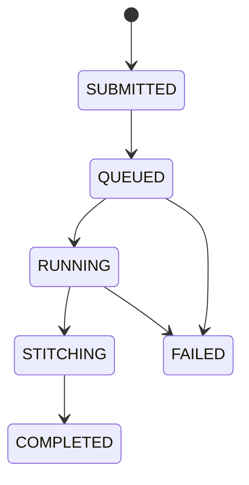

# RFC-02: Runtime API and YAML Contracts

Date: 2025-10-18  
Status: Proposed  
Owner: Ricard Santiago Raigada García

## ADR Links

[#2 Product](../adr/0002-hybrid-hpc-qc-middleware-and-runtime-product.md)  
[#15 Python bindings](../adr/0015-python-bindings-with-pybind11.md)  
[#23 Configuration YAML](../adr/0023-configuration-and-contracts-in-yaml.md)

## Motivation

The API must expose dispatch, monitoring, and collection semantics consistently across the C++ and Python bindings—whenever a high-level interface is deemed necessary. Therefore, a clear contract is required between user applications and the hybrid runtime environment.

## Scope

- C++23 API surface and Python mirror  
- YAML job-spec schema  
- Error states and lifecycle  

## Design

### C++ API

```cpp
class Runtime {
 public:
   JobId submit(const YamlConfig& config, const IRGraph& ir);
   JobStatus query(JobId id) const;
   Result collect(JobId id);
   void cancel(JobId id);
};
```

### Python Binding

Generated via `pybind11`; one-to-one method exposure.

### YAML Contract

```yaml
job:
  name: N2-benchmark
  backend: ibm_torino
  waves: 2
resources:
  cpus: 32
  gpus: 4
  memory_gb: 128
  qpu_window: "00:05:00"
models:
  alpha: 0.6
  beta: 0.3
  gamma: 0.1
fidelity:
  max_deltaF: 0.02
```

### Job Lifecycle



### Error Semantics

- `ValidationError`: malformed YAML or IR
- `ResourceError`: RMS allocation failure
- `TransportError`: QPU endpoint unreachable
- `StitchError`: tensor contraction failure

## Rationale

Explicit contracts simplify orchestration workflows (Snakemake/Nextflow)
and enable deterministic replay.

## Acceptance Criteria

- CLI and Python bindings share a single code path.
- Runtime state machine reproducible in integration tests.
