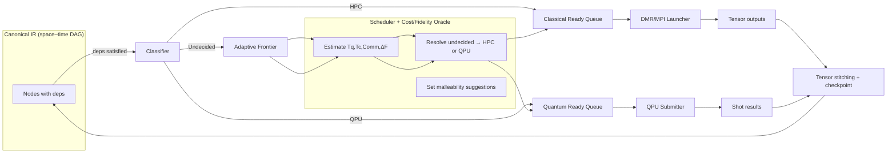
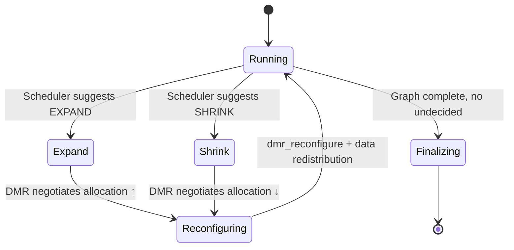
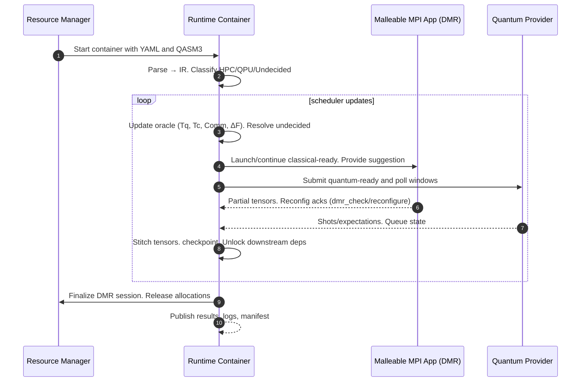

# SDLC of the Hybrid HPC–QC Runtime

## 1. Lifecycle overview

The lifecycle is a closed loop per task. The resource manager creates a new instance of the execution container, which carries out all the planning and execution phases, and terminates when the results and artifacts have been written. The process is invariant between experiments, as only the data, configuration, and fidelity targets change, while the control mechanism remains the same.

[View SDLC diagram in a new window](./img/sdlc_overview.png){target="_blank"}

```mermaid
flowchart LR
  A[Submit job] --> B[Start runtime container]
  B --> C[Read YAML config and QASM3]
  C --> D[Parse to canonical space–time IR]
  D --> E[Partition: wire cuts and time cuts]
  E --> F[Cost & fidelity modelling]
  F --> G[Continuous dispatch: classify HPC / QPU / Undecided]
  G --> H{Dependencies satisfied?}
  H -->|No| F
  H -->|Yes| I[Resolve undecided via oracle and telemetry]
  I --> J[Launch classical-ready via DMR/MPI]
  I --> K[Submit quantum-ready to provider]
  J --> L[Partial tensors]
  K --> M[Shots & expectations]
  L --> N[Tensor stitching & checkpoint]
  M --> N
  N --> O[Metrics & feedback to scheduler]
  O --> H
  O --> P{Graph complete?}
  P -->|No| H
  P -->|Yes| Q[Finalize DMR session & release resources]
  Q --> R[Publish results, logs, manifest]
```

## 2. Ingestion and normalization

At container start, the runtime reads a YAML configuration document that sets resource limits, vendor credentials, scheduling preferences, and other parameters. The quantum circuit is accepted into OpenQASM3 and parsed to generate an internal directed spacetime acyclic graph. This internal representation preserves allocation or mapping indications and metadata such as the number of two-qubits per region, the expected depth per layer, and the logical boundaries that define natural slicing opportunities. Therefore, the ingestion phase is deterministic, and the output is the canonical graph used by the partitioner and scheduler.

## 3. Partitioning in space and time

The first phase of transformation is partitioning. The partitioner searches for bipartitions with low correlation for wire cuts and identifies suitable time layers for temporary cuts. It uses annotations generated by ingestion and consults cost and fidelity models to reject cuts that exceed the established penalties. The result is therefore a set of subcircuits classified as classical or quantum based on their computational nature, along with data dependencies that will later determine the assembly. These partitioning decisions are made with full graph visibility, but they do not allocate resources. That is, they generate a slicing plan that the scheduler can review with telemetry information in later phases.

## 4. Cost and Fidelity Modeling

The runtime estimates four quantities for planning: quantum time (provider queueing and native gate performance), classical time (node count, ranks per node, accelerator availability), communication (collectives, data redistribution, and reconfiguration overhead), and fidelity loss (accumulated cut errors and contraction approximations). Parameters are calibrated from prior runs or provider metadata and refined online via the feedback channel. The scheduler uses the model as an oracle—not as a fixed contract—so it can steer undecided regions and resource sizes to meet time-to-solution under fidelity constraints.

## 5. Planning

Following ingestion and partitioning, the runtime environment operates a continuous dispatch model based on three classes of subcircuits: those annotated for classical execution, those annotated for quantum execution, and those marked as undecided.

The scheduler maintains three logical queues backed by a single graph that considers dependencies: a ready queue for classical subcircuits, a ready queue for quantum subcircuits, and an adaptive boundary for undecided subcircuits.

Subcircuits in a ready queue for classical execution are immediately sent to the MPI (Multi-Process Intake) environment; while subcircuits in the quantum execution queue are sent directly to the quantum backend. Undecided subcircuits, on the other hand, are resolved in each scheduler update by consulting the cost-fidelity model and the current state of the system. Often, it is unclear whether some potential partitions offer a real benefit in running classically or quantum. Therefore, this concept allows us to enhance the performance and utilization of the hybrid system by deciding where to allocate these types of subcircuits.

This continuous model preserves graph-level determinism and maximizes performance: execution time is never delayed by pending quantum submissions, nor is it blocked by classical batches still being processed. The undecided class allows the scheduler to leverage the latest telemetry and queue signals before definitively assigning a subcircuit to a backend.

## 6. Malleability as a Continuous Control Loop

Malleability is implemented as a continuous control loop, rather than as a phase boundary. The scheduler monitors the classical queue, tensor-contraction load, communication pressure, and the expected duration of pending quantum requests. Based on these signals, it generates suggestions for the malleable MPI application to expand, shrink, or maintain the current allocation.

The suggestions are synchronized at safe points in the application's control flow, typically before or after shrinkage segments that can be controlled by checkpoints. This mechanism does not require pausing all work: the malleable library negotiates the reconfiguration with the resource manager and exposes an intercommunicator to redistribute the data. The result is that the classical capacity $k$ adjusts to the instantaneous combination of the classical queue and the downtime induced by quantum computing.

## 7. Orchestration of classical and quantum work

The runtime environment orchestrates classical and quantum work using independent executors, both controlled by the same dependency graph.

The classical executor invokes the DMR wrapper to launch the malleable MPI application and transmits the inputs for each subcircuit prepared for classical computation. Within the application, periodic calls to `dmr_check` apply the scheduler's suggestions; if a change is approved, the application goes through `dmr_reconfigure`, redistributes the data through the new communicator, and resumes.

The quantum executor sends the subcircuits prepared for quantum computation to the quantum backend, monitors the queue state, manages retries within the configured budget, and outputs the results as they become available.

Since both executors generate inputs for the assembly stage, classical contraction naturally overlaps with quantum measurement whenever the graph allows.

## 8. Tensor stitching and durability

The structure stitching process consolidates classical tensors and quantum results into consistent intermediate states. Contractions are accelerated using GPUs.

After each successful stitch, the runtime environment creates a checkpoint with the identifiers of all satisfied dependencies, so that subsequent nodes can be re-evaluated if the scheduler resolves previously undecided subcircuits differently.

Durability is ensured by parallel I/O, and each checkpoint is self-descriptive, so recovery requires no external coordination.

## 9. Termination and Reproducibility Properties

When the dependency graph has no unsatisfied nodes, both executors terminate their work in progress, and the scheduler validates that no undecided nodes remain.

The runtime environment terminates the malleable session, releases the allocations, and generates a manifest listing the inputs, versions, and outputs. Reproducibility is derived from the container image, the canonical intermediate representation generated by the parser, the deterministic classifier, and the structured artifacts written during ingestion, dispatch, and assembly. Since dispatch is continuous and dependency-based, repeating the same job with the same configuration produces identical commit decisions for decided nodes and the same admissible set for undecided nodes; any differences in allocations for undecided nodes are justified by telemetry and logged in the decision log.
